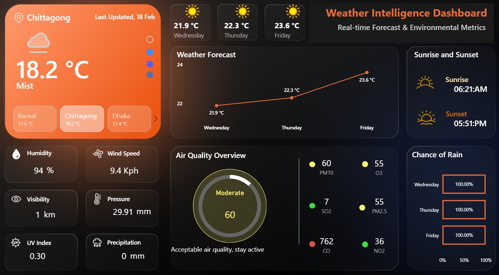
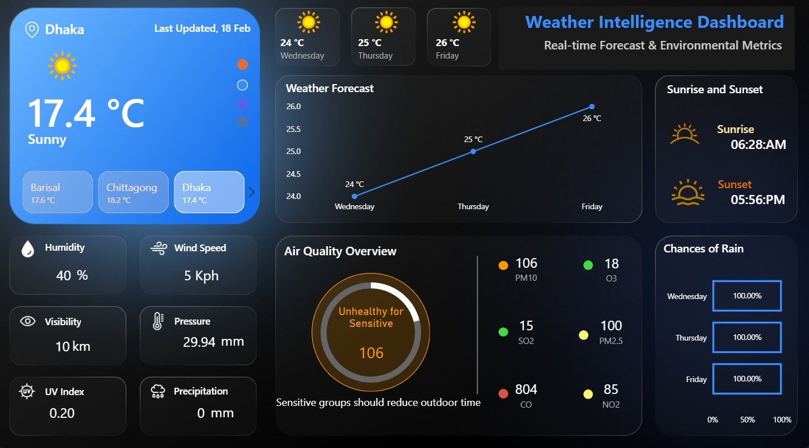
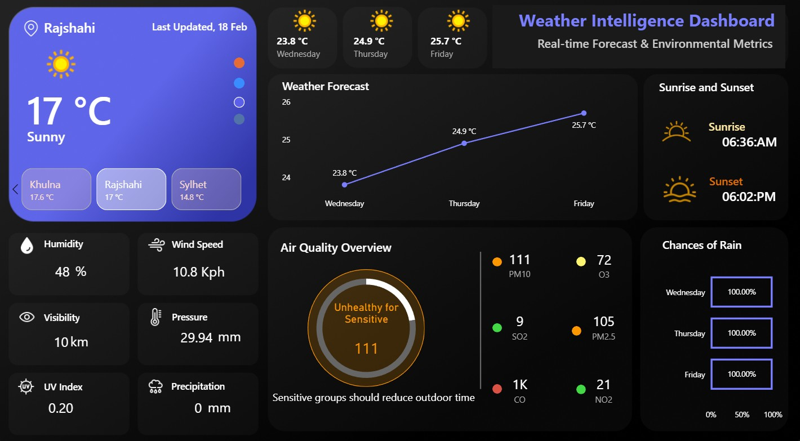
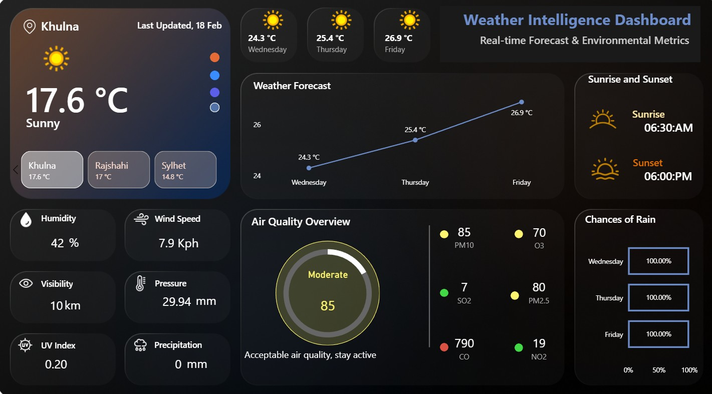

# Weather Intelligence Dashboard: Real-Time Forecast & Environmental Metrics

## 📊 Dashboard Preview
<p align="center">
  
  
  
  
  
</p>

## 📌 Project Overview
The **Weather Intelligence Dashboard** is an enterprise-grade reporting solution designed to deliver comprehensive, localized weather monitoring and environmental insights. By integrating real-time meteorology data with air quality indices (AQI), this dashboard serves as a strategic tool for operational planning, health advisory compliance, and logistical decision-making across key regions (Dhaka, Chittagong, Barisal).

### 🔗 Interactive Report Live Link
* [👉 Click Here to View the Interactive Dashboard Portfolio](YOUR_POWER_BI_SERVICE_PUBLIC_OR_NOVYPRO_LINK_HERE) *

---

## 🛠️ Tech Stack & Key Features
* **Power Query / ETL:** Engineered automated transformations, ensuring explicit column typing, null-value mitigation, and unit standardizations (e.g., Wind Speed to Kph, Pressure calculations).
* **Data Modeling:** Optimized a clean Star Schema utilizing 1-to-Many (`1:*`) relationships for crisp filter propagation.
* **Dynamic Theme & UX:** Implemented a modern glassmorphism dark theme featuring data-driven, conditional color-coded KPI elements.
* **Advanced DAX:** Housed performance-oriented explicit calculations in a isolated measure matrix container.

---

## 📐 DAX Calculation Showcase

To optimize model processing efficiency, calculated columns were avoided in favor of explicit DAX measures:

### Dynamic Air Quality Health Assessment
```dax
AQI Health Assessment = 
VAR CurrentAQI = SELECTEDVALUE('Fact_AirQuality'[AQI_Value])
RETURN
SWITCH(
    TRUE(),
    CurrentAQI <= 50, "Good Quality",
    CurrentAQI <= 100, "Moderate",
    CurrentAQI <= 150, "Sensitive groups should reduce outdoor time",
    "Unhealthy Conditions"
)
